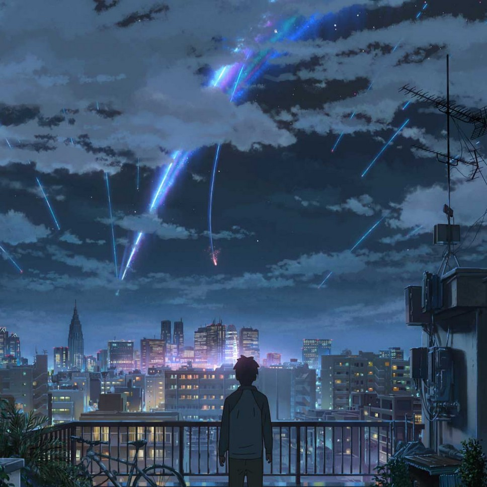
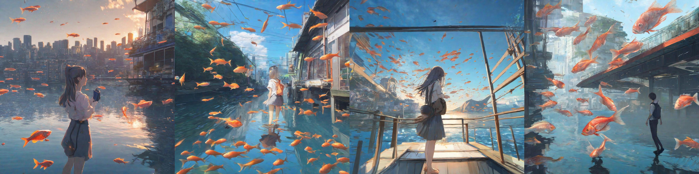
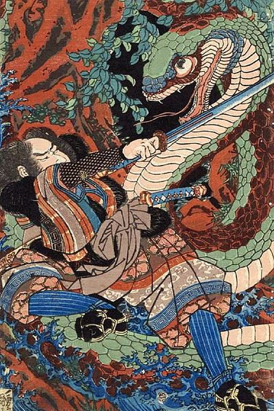
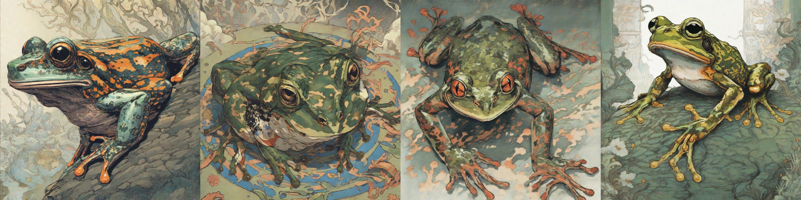
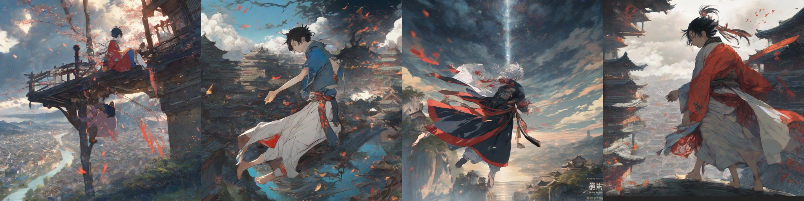

# sdxl-revision-styling
*Using SDXL's Revision workflow with and without prompts*

The Stability AI team released a [Revision](https://huggingface.co/stabilityai/control-lora#revision) workflow, where images can be used as prompts to the generation pipeline. This is similar to Midjourney's [image prompts](https://docs.midjourney.com/docs/image-prompts) or Stability's previously released [unCLIP for SD 2.1](https://github.com/Stability-AI/stablediffusion/blob/main/doc/UNCLIP.MD).

From our experience, Revision was a little finicky with a lot of randomness. In particular, it didn't seem to work well with text prompts ([related blogpost](https://mybyways.com/blog/sdxl-revision-workflow-in-comfyui)).

After some experimentation, we found what seems to be a relatively good mix of parameters that worked with Revision, both with and without prompts. Essentially, the trick was to rescale the image and prompt embeddings, and not to use the prompt's pooled embeddings.

```python
# From text2img.py
result: Image.Image = SDXL_MODEL(
    # Scale down prompt_embeds
    prompt_embeds=prompt_embeds * 0.8,
    # Scale up image_embeddings
    pooled_prompt_embeds=image_embeddings*2,
    guidance_scale=7.0,
    num_inference_steps=20,
    generator=None if seed is None else torch.manual_seed(seed),
).images[0]
```

There's still a lot of randomness involved, but hopefully this helps anyone who is trying to get Revision to work!

## Results

See [related Reddit post](https://www.reddit.com/r/StableDiffusion/comments/16e39dy/using_revision_with_text_prompts_to_apply_styles/) for more results.

**Reference image** from [Your Name, directed by Makoto Shinkai, 2016](https://en.wikipedia.org/wiki/Your_Name)



Using prompt "**fish**" with seeds 0 to 3 from left to right



**Reference image** from [the Suikoden series by Utagawa Kuniyoshi, 1830](https://en.wikipedia.org/wiki/Ukiyo-e#/media/File:Kuniyoshi_Utagawa,_Suikoden_Series_4.jpg)



Using prompt "**frog**" with seeds 0 to 3 from left to right



Mixing the 2 reference images without prompt with seeds 0 to 3 from left to right



## Code & Instructions

The code uses [ComfyUI's](https://github.com/comfyanonymous/ComfyUI) CLIP vision loader to load the CLIP vision model, and [diffusers](https://github.com/huggingface/diffusers) to load the SDXL model. There are also minor patches to the diffusers' default Euler scheduler and a sharpness patch adapted from [Fooocus](https://github.com/lllyasviel/Fooocus).

You will need the [CLIP safetensors](https://huggingface.co/stabilityai/control-lora/blob/main/revision/clip_vision_g.safetensors) and [SDXL safetensors](https://huggingface.co/stabilityai/stable-diffusion-xl-base-1.0/blob/main/sd_xl_base_1.0_0.9vae.safetensors).

Then run the following to generate the first image above (reference: "your_name.jpg", prompt: "fish", seed 0)

```python
$ python3 main.py -p "fish" -i "./samples/your_name.jpg" --seed 0 --clip_model "PATH_TO_CLIP_SAFETENSORS" --sdxl_model "PATH_TO_SDXL_SAFETENSORS"
```
